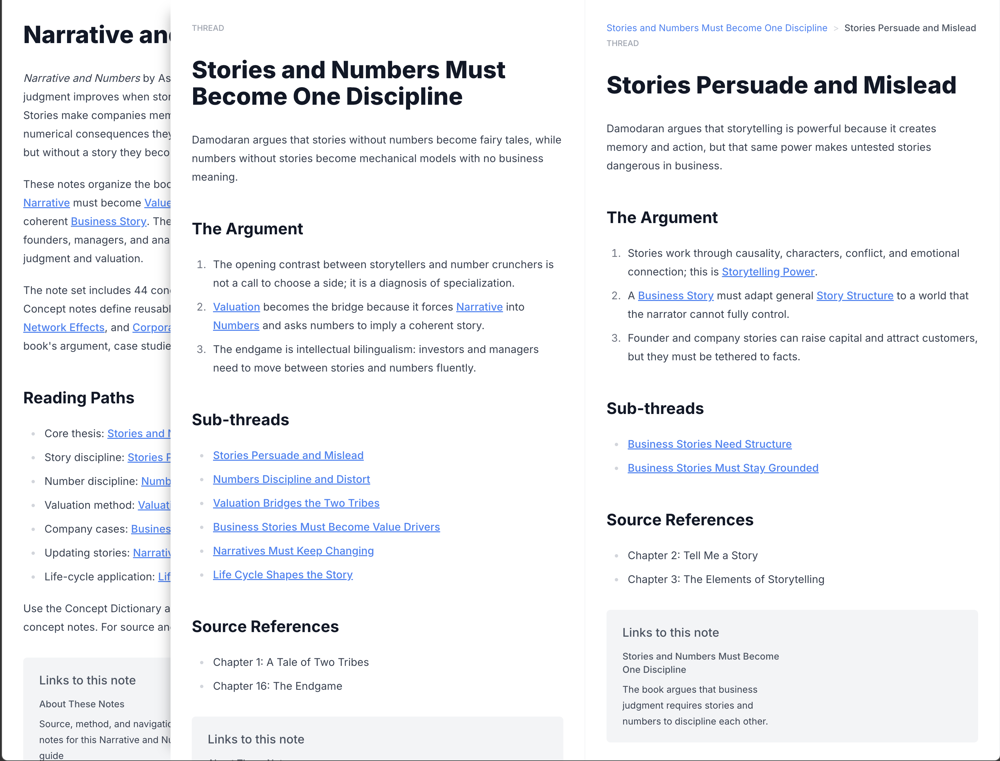

# Infinity Notes

Infinity Notes is a small TypeScript monorepo for publishing interconnected
markdown notes as a browsable knowledge graph.



It has three runtime parts:

- `@infinity-notes/note-processor` parses markdown notes, wiki links, backlinks,
  note previews, concepts, and thread breadcrumbs.
- `@infinity-notes/worker` serves the note API from Cloudflare Workers and R2.
- `@infinity-notes/frontend` renders the notes in a Vite React app.

The `create-infinity-notes` CLI creates a book content directory with metadata,
starter notes, and an upload script.

## Quickstart

Install dependencies and verify the workspace:

```bash
pnpm install
pnpm verify
```

Build all packages:

```bash
pnpm build
```

Run the test suite:

```bash
pnpm test
```

## Create a Book

Use the CLI to create a new book content directory:

```bash
npx create-infinity-notes my-book
```

The CLI prompts for:

- book title
- book id
- authors
- description
- R2 key prefix

It creates a directory like this:

```text
my-book/
  meta.json
  notes/
    Welcome.md
    About.md
    concepts/
      .gitkeep
    threads/
      .gitkeep
  upload.sh
  wrangler.toml
  README.md
```

Edit the markdown files under `notes/`, then upload the book content:

```bash
cd my-book
INFINITY_NOTES_BUCKET=your-r2-bucket \
INFINITY_NOTES_R2_PREFIX=books \
INFINITY_NOTES_WORKER_URL=https://your-worker.workers.dev \
./upload.sh my-book
```

The upload script writes `meta.json` and every `notes/**/*.md` file to R2, then
calls the worker rebuild endpoint for that book.

## Note Format

Notes are markdown files. The filename, relative to `notes/`, becomes the note
path. For example, `notes/concepts/Feedback Loop.md` becomes
`concepts/Feedback Loop`.

Use front matter for metadata:

```md
---
title: Feedback Loop
snippet: A cycle where outputs influence future inputs.
type: concept
---

# Feedback Loop

A feedback loop connects outputs back into future inputs.

See [[Compounding]] and [[Small Notes Become Systems]].
```

Supported front matter:

- `title`: display title; defaults to the note path.
- `snippet`: short preview text; defaults to the first non-heading lines.
- `type`: optional `concept` or `thread`.
- `parent`: parent note path or title, used for thread breadcrumbs.
- `source_chapter`: optional numeric chapter path, such as `[1, 2]`.

Link between notes with double brackets:

```md
This note references [[Feedback Loop]].
```

The processor resolves links against note paths and titles, builds backlinks,
and emits hydrated note JSON for the frontend.

## Run Locally

Run the worker API:

```bash
pnpm --filter @infinity-notes/worker dev
```

Run the frontend:

```bash
pnpm --filter @infinity-notes/frontend dev
```

The frontend dev server proxies `/api` requests to `http://localhost:8787`.
For production builds, set `VITE_API_URL` if you need to override the default
worker API URL:

```bash
VITE_API_URL=https://your-worker.workers.dev/api pnpm --filter @infinity-notes/frontend build
```

## Package Overview

```text
packages/
  create-infinity-notes/  CLI for creating book content directories
  note-processor/         Markdown parsing, links, backlinks, previews, indexing
  worker/                 Hono API for Cloudflare Workers and R2
  frontend/               Vite React frontend
```

Useful package commands:

```bash
pnpm --filter create-infinity-notes build
pnpm --filter @infinity-notes/note-processor test
pnpm --filter @infinity-notes/worker build
pnpm --filter @infinity-notes/frontend build
```

## Worker API

The worker exposes:

- `GET /api/books`
- `GET /api/books/:bookId/previews`
- `GET /api/books/:bookId/concepts`
- `GET /api/books/:bookId/note/*`
- `POST /api/books/:bookId/rebuild`

Book content is stored under:

```text
<R2_PREFIX>/<bookId>/meta.json
<R2_PREFIX>/<bookId>/notes/**/*.md
```

Rebuilding a book reads markdown from R2 and writes generated JSON indexes:

```text
<R2_PREFIX>/<bookId>/_previews.json
<R2_PREFIX>/<bookId>/_notes/<notePath>.json
<R2_PREFIX>/_catalog.json
```

## Deployment Basics

Configure the worker R2 binding in `packages/worker/wrangler.toml`:

```toml
[[r2_buckets]]
binding = "NOTES_BUCKET"
bucket_name = "your-r2-bucket"

[vars]
R2_PREFIX = "books"
```

Deploy the worker with Wrangler:

```bash
pnpm --filter @infinity-notes/worker build
cd packages/worker
pnpm exec wrangler deploy
```

Build the frontend with the deployed worker API URL:

```bash
VITE_API_URL=https://your-worker.workers.dev/api pnpm --filter @infinity-notes/frontend build
```

Deploy `packages/frontend/dist` with your static hosting provider.

## Examples

Only sanitized examples are committed to this repository.

- `examples/demo-basic/` contains a small public note graph.
- Private, generated, or book-derived examples are intentionally ignored.

## Release Safety

Before publishing packages or pushing a public release, run:

```bash
pnpm pack:check
pnpm verify
```

`pnpm pack:check` verifies that:

- only public-safe example files are visible to git;
- every publishable package has a `files` allowlist;
- npm package dry-runs do not include examples, local env files, build caches,
  Wrangler state, or nested dependencies.

## Contributing

Use pnpm for workspace operations. Keep generated content, private examples,
local R2 state, and dependency directories out of commits.

For changes that affect package output, run:

```bash
pnpm verify
```
